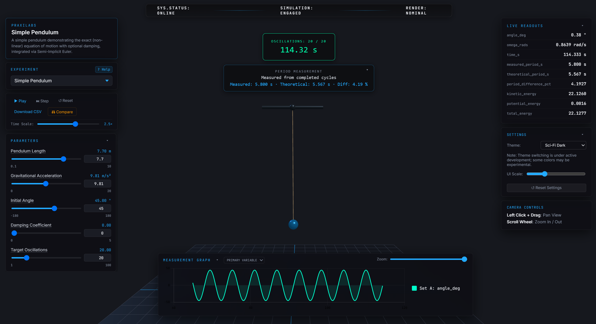
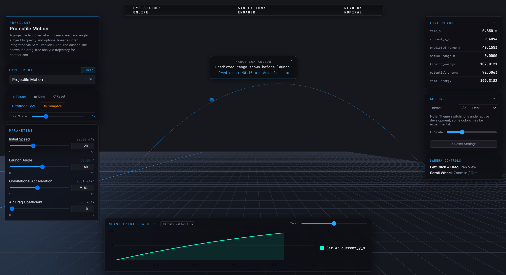
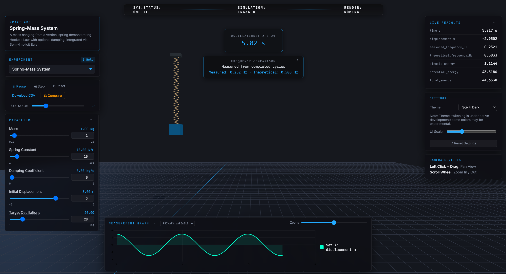
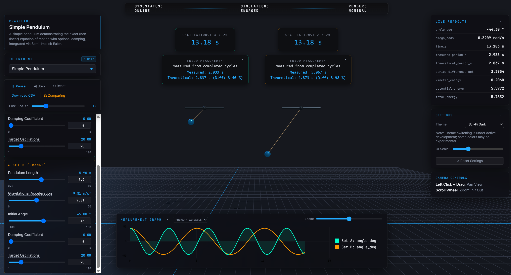

# Physics Experiments Suite





A modular, browser-based physics laboratory built with Three.js and TypeScript. This platform features a shared core framework capable of running interchangeable physics experiments seamlessly.

## Quick Start
To run this project locally, you will need Node.js. If you do not have it installed, please download and install the recommended LTS version from the [official Node.js website](https://nodejs.org/).

Once Node.js is installed, open your terminal in the project root and run:

```bash
npm install
npm run dev
```

The application will be available at `http://localhost:5173`.

## Architecture Overview
The platform is built on a **Modular Plugin Architecture** that utilizes the **Strategy Pattern** to ensure strict separation of concerns and flawless AI extensibility. *(To simplify: think of the core engine as a video game console, and the individual experiments as interchangeable cartridges).*

*   **Core Engine (The Host):** Resides in `src/core/`. It acts as the context, handling the fixed-timestep physics loop and dynamically auto-generating UI sliders based on the active experiment's parameter schema.
    *   **The Master Scene Strategy:** To prevent memory hemorrhaging and WebGL crashes during experiment swaps, `Engine.ts` owns one single, persistent Three.js master scene, camera, and renderer. 
*   **Experiments (The Strategies):** Reside in `src/experiments/`. Each experiment strictly implements the `IExperiment` interface. 
    *   When loaded, an experiment is passed the master scene (e.g., `pendulum.setup(scene)`) and only adds its specific meshes into the room. When swapped out, the core calls `dispose()`, forcing the experiment to delete its shapes, geometries, and materials before the next experiment loads.
*   **Decoupled Logic:** The core engine is completely blind to which experiment is running. Adding a new experiment requires only dropping a new class file into the directory and registering it, touching zero core rendering or UI files. **(See `docs/api-contract.md` for the exact developer guide on how to build one).**
*   **Comparison Mode:** Click the **⚖ Compare** button in the controls bar to spawn a second independent instance of the current experiment side-by-side (offset 30 units right on the lab table). Each instance has its own parameter sliders (Set A / Set B) and its own physics accumulator, while sharing the master scene, camera, and renderer. The graph shows both datasets simultaneously as coloured lines (cyan vs. orange).
    <br><br>
    

## Tech Stack & Integrator Choice
*   **Frontend & Bundling:** Vanilla TypeScript powered by Vite. No heavy frontend frameworks (React/Vue) were used to minimize unnecessary dependencies. HTML/CSS is overlaid directly on the canvas.
*   **3D Engine:** Three.js.
*   **Graphing:** Chart.js is used for plotting real-time 2D measurement data with high-DPI canvas scaling.
*   **Testing:** Vitest for isolated testing of pure physics functions.
*   **Physics Integrators:** A swappable `IIntegrator` module (`src/core/Integrator.ts`) supports:
    *   **Semi-Implicit Euler (Default):** Symplectic, conserves energy in oscillating systems.
    *   **Explicit Euler:** Included for educational comparison (demonstrates energy divergence).
    *   **Runge-Kutta 4 (RK4):** High-precision 4th-order method for complex trajectories.
*   **Physics Audit:** The engine has undergone a rigorous, mathematically verified audit covering dimensional analysis, conservation laws, and frame-rate independence (see `PHYSICS_AUDIT.md`).

## Project Structure
```text
/
├── .agents/                # AI workflow rules and persistent configuration
├── docs/                   # Documentation and user guides
│    └── api-contract.md    # The Developer & AI Agent guide for adding new experiments
├── helpers/                # Utility scripts
├── public/                 # Static assets
├── src/
│    ├── core/              # Master scene rendering, dynamic UI, and fixed-timestep loop
│    ├── experiments/       # Individual experiment modules and IExperiment contract
│    └── main.ts            # Entry point wiring the engine and active experiment
├── tests/                  # Vitest unit tests for physics logic
├── AI_USAGE.md             # Documentation of AI prompts, workflows, and corrections
└── package.json            
```

## Testing & Verification
The project is verified with the following commands:

```bash
npm install
npx tsc --noEmit
npm test
```

These checks confirm the TypeScript build is clean and the Vitest physics tests pass. The automated suite (`tests/physics-audit.test.ts`) covers fixed-timestep accumulation, exact mathematical integration convergence (RK4 vs Euler), symplectic energy bounds, and invariant physics conditions.

### Audit Notes
A rigorous mathematical physics audit has been performed on this engine. See the `PHYSICS_AUDIT.md` file in the repository root for the exact numeric results proving stability, symplectic energy bounds, and convergence order across all experiments.

## Known Limitations & Future Work
If I had more time outside of the initial timebox, I would implement the following:
1.  **Advanced 3D Interactivity:** Currently, the parameter schema completely drives the physics state. I would add `THREE.Raycaster` support so users could click and drag the pendulum bob or spring mass directly in the 3D canvas to set the initial displacement, which would natively bi-directionally sync back to the HTML sliders.