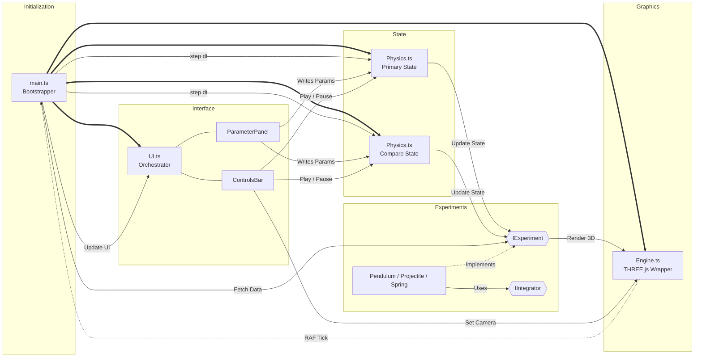

# System Architecture

This document provides a comprehensive overview of the PraxiLabs Physics Engine's architecture, detailing the strict decoupling between the 3D rendering loop, the physics state, the UI layer, and the dynamic experiment modules.

## High-Level Data Flow & Control Loop

The core principle of this engine is a **Zero-Touch Core** with a strictly separated physics accumulator and render loop.

*(Note: The Comparison Mode module and Integrator architectures are experimental and currently under development.)*

## Component Breakdown

### 1. Engine (`Engine.ts`)
- **Responsibility:** Strictly handles THREE.js setup, scene graph, cameras, lighting, and the browser `requestAnimationFrame` (RAF) loop.
- **Constraints:** Knows absolutely *nothing* about physics logic. It only provides a callback hook (`setPhysicsTickCallback`) for the outside world to execute code per frame.
- **Features:** Studio 3-point lighting, volumetric fog, dynamic camera panning for Compare Mode, window resize handling.

### 2. Physics (`Physics.ts`)
- **Responsibility:** Manages time accumulation, pause/play state, and acts as the data store for the user's parameter inputs (sliders).
- **Architecture:** We instantiate *two* completely independent instances of `Physics` (`physics` and `physics2`). This allows Compare Mode to run a parallel simulation completely isolated from the primary simulation.

### 3. UI (`UI.ts`, `ControlsBar.ts`, `ParameterPanel.ts`, `GraphPanel.ts`)
- **Responsibility:** Purely a DOM manipulation layer. 
- **Data Binding:** It reads the parameter schema directly from the active `IExperiment` and dynamically constructs sliders. When a slider moves, it writes directly to the associated `Physics` instance's `currentParams` object.
- **Compare Mode:** When active, `ParameterPanel` generates two distinct panels (Set A and Set B), and routes their inputs to `physics` and `physics2` respectively.

### 4. Experiments (`IExperiment.ts` & Implementations)
- **Responsibility:** Defines the mathematical model, numerical integrator (e.g., Semi-Implicit Euler, RK4), and the 3D meshes for a specific phenomenon.
- **Contract:** Must define a `schema` detailing what parameters it accepts. Must implement `setup(scene)`, `render()`, `dispose()`, and `getMeasurements()`.
- **Extensibility:** Adding a new experiment requires creating a single file that implements `IExperiment` and calling `registerExperiment()` in `main.ts`. No core files ever need modification.

### 5. Integrators (`Integrator.ts`)
- **Responsibility:** Abstract mathematical engines that solve the differential equations defined by the experiments over time.
- **Implementations:** Semi-Implicit Euler (Symplectic, default), Explicit Euler (Divergent, for education), and RK4 (4th-order high precision).
- **Architecture:** Experiments define their `derivative()` functions and pass them to the selected `IIntegrator` module every frame, allowing users to hot-swap integration methods at runtime without touching the physical simulation logic.

## The RAF Tick Lifecycle
Every frame, the following sequence perfectly executes:
1. `Engine.ts` calculates `dt` (delta time) and fires the callback to `main.ts`.
2. `main.ts` calls `physics.step(dt)` and `physics2.step(dt)`.
3. The `Physics` instance applies its fixed-timestep accumulator logic. If it ticks, it calls `experiment.update(fixedDt, currentParams)`.
4. `main.ts` requests `getMeasurements()` from the active experiments.
5. `main.ts` pushes the new measurements into `ui.updateReadouts()` and `ui.updateGraph()`.
6. `Engine.ts` resumes control, calls `experiment.render()` to sync mesh positions, and calls `renderer.render()`.
